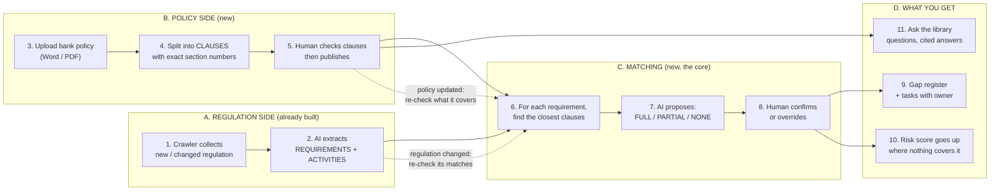
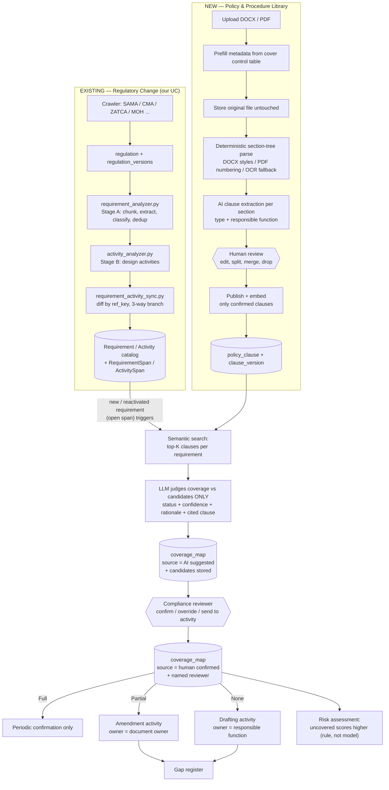
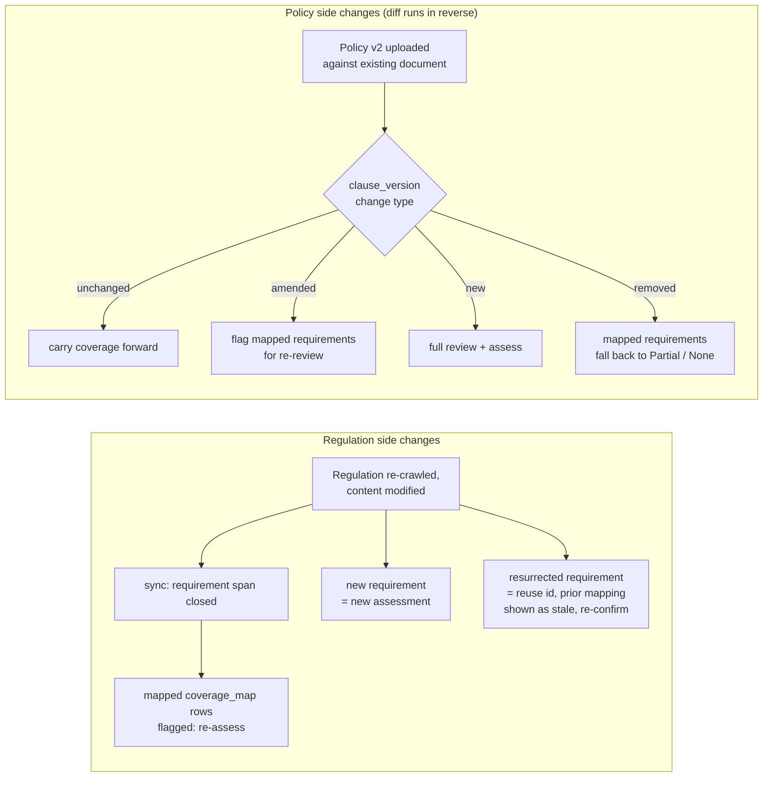
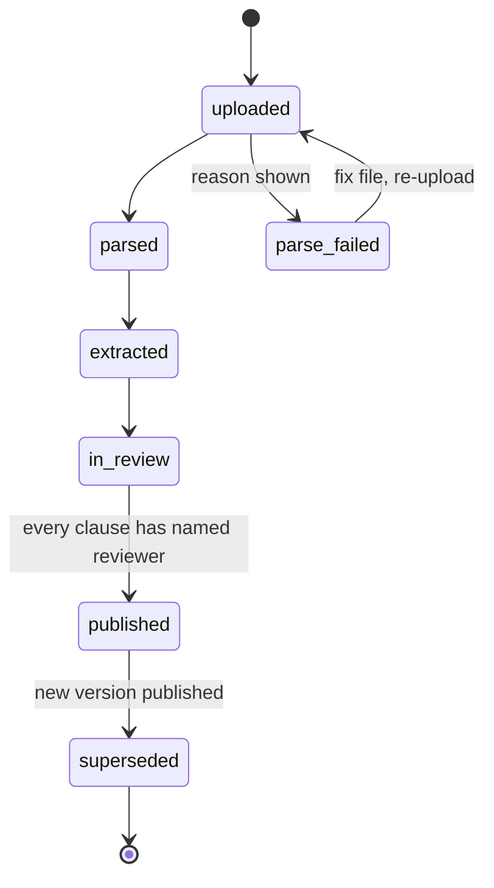
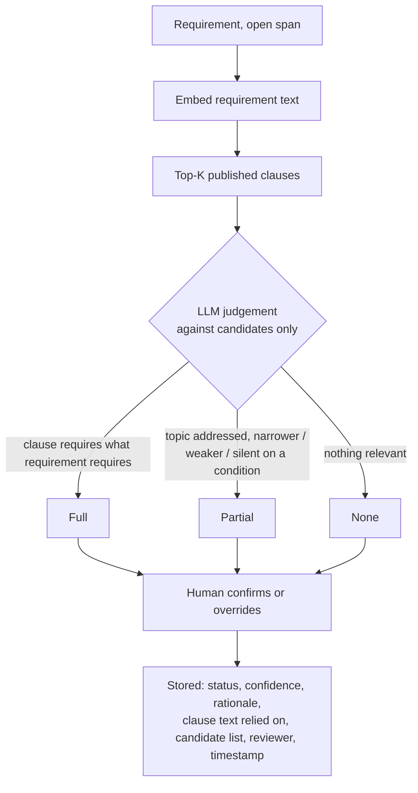

# Policy & Procedure Library (PPL) — design mapped onto our Regulatory Compliance Library

Source: *RiskNucleus — Policy & Procedure Library, module overview* (PPL, status: Design, depends on Regulatory Change).

**Our UC is the "Regulatory Change" module the overview depends on.** So the two sides of the coverage map are:

| PPL overview says | In our system |
|---|---|
| "obligation" / "obligations library" (regulator's language) | `Requirement` rows (+ `RequirementCategory`, `RequirementType`), identified by `ref_key` `REQ-{reg_id}-{hash}` |
| "activity" raised from a gap | `Activity` rows (`ACT-{requirement_id}-{hash}`) — see §F11 for the two kinds of activity |
| "obligation extraction" step | `NewOrchestrator._run_requirement_activity_analysis` → `requirement_analyzer.py` (Stage A) + `activity_analyzer.py` (Stage B) |
| "version / superseded" | `regulation_versions` + `RequirementSpan` / `ActivitySpan` |
| `policy_clause` (bank's language) | **new** — nothing like it exists yet |
| `coverage_map` | **new** |

---

## 0. The whole thing on one page

Read it left to right. Two inputs (the regulator's rules, the bank's policies) are matched, and the result is a list of gaps that become tasks.

### What each number means

| # | Step | In plain words | Who does it |
|---|---|---|---|
| 1 | Crawler | Our existing crawlers pull in a new or changed regulation | system |
| 2 | Extraction | Existing pipeline turns it into Requirements (what must be done) and Activities (tasks to do it) | AI |
| 3 | Upload | Compliance uploads an approved policy. Title, owner, version are prefilled from its cover page | person |
| 4 | Clause split | The document is cut into single statements using its real headings and numbers ("AML Policy 3.2, section 4.1.2"). Scanned files are marked low confidence | system, then AI |
| 5 | Review and publish | A person fixes, splits, merges or drops clauses. Nothing continues without a named reviewer | person |
| 6 | Find candidates | Search finds the few policy clauses closest in meaning to each requirement | system |
| 7 | AI judgement | AI looks only at those clauses and proposes a status with its reasoning | AI |
| 8 | Confirm | A compliance reviewer accepts or changes it. Their decision is the official one | person |
| 9 | Gaps become tasks | See below | system |
| 10 | Risk | A rule (not AI): uncovered requirement = higher risk | system |
| 11 | Ask the library | Type a question, get an answer quoting the exact clauses | AI |

### The three outcomes at step 8

| Status | Meaning | What happens |
|---|---|---|
| **Full** | A clause already requires this | Nothing, just re-confirm periodically |
| **Partial** | Clause exists but is weaker or narrower | Task "amend the policy", given to the policy owner |
| **None** | No policy says anything about it | Task "write a new clause", given to the responsible team |

### Later (phase 2, not in the first release)
AI drafts the missing clause text, matching re-runs automatically on each policy's review date, and clauses get linked to the controls that test them.

### Rules that apply everywhere
AI never publishes or confirms anything on its own. All AI runs in the same in-region setup we already use, with no new outside service. Word/PDF upload only (no SharePoint), no editing of policies inside the app, and no approval workflow.

---

## 1. Flow diagram (split into focused views)

### 1.1 End-to-end: from regulator source to gap activity

### 1.2 Feedback loops (why the map stays alive)

### 1.3 Document status lifecycle

### 1.4 Coverage decision (per requirement)

---

## 2. Functionality breakdown

The overview is broken into 14 functions. Each lists **what the doc says**, **how it works**, and **how it ties to our UC**.

### F1. Purpose: answer "are we already doing this?" with a clause citation

- **Doc says:** a new circular today costs about two weeks of emailing department heads. The module answers in minutes, citing the exact clause.
- **Design stance:** the library is a **read-only mirror** of approved policies, split into clauses and linked to obligations. It does not replace document management or authoring. Policies are drafted, approved and stored where they are today. PPL ingests the approved version.
- **The core asset is the coverage map**, the confirmed obligation → clause link. Every other feature (gap register, ask-the-library, risk score, change impact) is a query against it.
- **Our UC:** the "new circular" arrives through the crawler, and our sync step produces the obligations side automatically. PPL is what turns our output from "here is what the regulator requires" into "here is what you already do and where you don't".

### F2. Data model: four tables

Embeddings live in **pgvector on the existing Postgres, on the same row as the clause text**. No separate vector store.

| Table | One row per | Key fields |
|---|---|---|
| `policy_document` | approved document, any version | title, type (policy / procedure / SOP / standard), owner, department, version, status, effective date, next review date, source file ref, approval ref |
| `policy_clause` | discrete statement in a document | document id, section ref, verbatim text, clause type (mandatory / guidance / definition / control statement), responsible function, embedding |
| `coverage_map` | obligation ↔ clause link | obligation id, clause id, status (full / partial / none), confidence, rationale, source (AI suggested / human confirmed), reviewer, timestamp |
| `clause_version` | clause snapshot per document version | clause id, version, text hash, change type (new / amended / removed / unchanged) |

Notes that matter:
- `policy_clause` is **deliberately the same shape as our `Requirement`**: same extraction pattern, same schema. That lets us reuse the Stage A extraction ideas (chunking, classification, dedup) with a section-tree instead of raw chunks.
- `coverage_map` is the only table that joins the two worlds. Its obligation id should be our **permanent `requirement_id`** (see F14 for why).
- Doc says "obligation ID, clause ID" as single columns, but a partial link can involve several clauses, and the doc separately says candidates are stored. Treat this as one row per (requirement, clause) plus a candidate list, not one row per requirement.

**Tension to resolve:** our production DB is **MSSQL**, and the doc assumes **Postgres + pgvector**. See §3 decision D1.

### F3. Ingestion pipeline (5 steps)

Principle: **extraction quality is set by the parse, not the model.** The section tree is built deterministically before any AI runs, so every clause carries a real citation such as "AML Policy v3.2, §4.1.2" and not a chunk number.

1. **Upload.** DOCX and PDF only. Metadata (title, version, owner, dates, approval ref) is pre-filled from the document-control table on the cover pages, then confirmed by the uploader. The original file is stored untouched and never edited in the app.
2. **Parse into a section tree.** DOCX uses heading styles and numbered list levels. PDF uses the text layer plus a section-numbering parser, with OCR **only** where no text layer exists. OCR'd documents are flagged **lower confidence**.
3. **Extract clauses.** Runs per section, with the section number and heading supplied as context. Returns discrete obligation-bearing statements, each tagged with clause type and responsible function.
4. **Human review.** Source text beside extracted clauses. The reviewer edits wording, **splits** a clause that bundled two obligations, **merges** over-split fragments, **drops** boilerplate. Bulk accept per section. Roughly 20–30 minutes for a 40-page policy.
5. **Publish and index.** Only confirmed clauses are embedded and searchable. **Nothing reaches the coverage map without a named reviewer.**

Our UC ties: we already have PDF text extraction (pymupdf/pypdfium2 in the venv) and a numbering-aware chunker in `requirement_analyzer.py`. Both are reusable for step 2. The multi-document bundling design (`documents=[{source_document, text}]`, never chunking across a document boundary) applies directly, since a policy can also have annexes.

### F4. Bulk backfill

- Day one brings **200–400 documents**. All are queued, parsed and extracted in the background.
- Compliance then **sequences which policy families are reviewed first**, so review effort goes where the risk is.
- **No SharePoint connector at launch.** Manual bulk upload avoids a security review blocking go-live.
- Implication: a job queue with per-document status (see F6), bounded concurrency (we already use `DOC_MAX_WORKERS`), and a review-priority field per policy family.

### F5. Versioning

- **Re-uploading against an existing document creates a version, not a duplicate.**
- **Unchanged** clauses carry their coverage mappings forward. **Amended** clauses are flagged for re-review. Only **new** clauses need full review. Versions 2 and 3 cost minutes.
- Mechanism: `clause_version` stores a text hash per clause per version and a change type (new / amended / removed / unchanged).
- Our UC ties: this is the same idea as our `ref_key` diff in `requirement_activity_sync.py`. See F14 and decision D3 for reusing the span model.

### F6. Document status lifecycle

`uploaded → parsed → extracted → in_review → published → superseded`. Failed parses stop at **`parse_failed`** with the reason shown, so the file can be corrected and re-uploaded (diagram 1.3).

### F7. Coverage mapping (the core)

Per obligation:
1. **Semantic search** over published clauses returns the top candidates.
2. The **model judges against those candidates only** (no free recall over the whole library), and writes a status with reasoning and the clause text it relied on.
3. A **compliance reviewer confirms or overrides. The override is what the bank stands behind.**

Statuses and what each triggers:

| Status | Meaning | Consequence |
|---|---|---|
| **Full** | an existing clause requires what the obligation requires | no action beyond periodic confirmation |
| **Partial** | topic addressed, but clause is narrower, weaker, or silent on a condition | **amendment activity** against the **document owner** |
| **None** | nothing in the library speaks to it | **drafting activity** against the **responsible function** |

**Audit requirement:** coverage is stored **with the candidates the judgement was made from**, so an auditor sees what the model looked at, not only what it concluded. This needs a candidates column (JSON, ranked, with similarity scores) or a child table.

### F8. AI capabilities (five, no more)

| # | Capability | Phase | What it does |
|---|---|---|---|
| 1 | Clause extraction | 1 | approved document → discrete, cited, typed clauses with named responsible function |
| 2 | Coverage assessment | 1 | judges each obligation vs retrieved clauses; records status, confidence, rationale for human confirmation |
| 3 | Ask the library | 1 | plain-language question answered from published clauses with citations (e.g. "what do we require before onboarding a PEP?") |
| 4 | Drafting assist | 2 | given a gap, drafts clause language in house style using the bank's comparable clauses as examples; attaches to the activity; a person places it in the document |
| 5 | Scheduled re-assessment | 2 | on a document's review date, re-runs coverage against the current obligations library and surfaces drift to the owner |

**Data-residency rule:** embeddings and inference run through the **same on-premise / in-region path** the Regulatory Change module already uses. Policy content is more sensitive than public regulation, so **no new external dependency**. This is a hard constraint on model and embedding choice.

### F9. Integration: Regulatory Change (our UC)

Coverage assessment **runs automatically after obligation extraction**, so impact analysis starts with a stated position instead of a blank form.

Concrete hook: after `sync_requirements_and_activities(...)` returns, take the requirements it inserted or reactivated (its `counts` already reports `requirements_reactivated`), and enqueue coverage assessment for them. Unchanged requirements are not re-assessed. Requirements whose span closed are excluded from the gap register.

### F10. Integration: Risk assessment

Coverage status feeds **inherent exposure**. An obligation with no policy coverage scores higher than one fully covered. **A rule, not a model.** Example rule: `None` +2, `Partial` +1, `Full` 0, unconfirmed (AI suggested only) treated as `None` until a reviewer confirms.

### F11. Integration: Activity assignment

Gaps become activities with the **owner already resolved**: document owner for an amendment, responsible function for a new procedure.

**Two different things are both called "activity" here.** Read this carefully:

| | Activity from our Stage B | Activity from a PPL gap |
|---|---|---|
| Meaning | task/control the bank performs to meet the requirement (Control Testing, Reporting Submission ...) | task to fix the policy library (amend clause / draft clause) |
| Created by | LLM, at extraction | coverage decision, after review |
| `ref_key` | `ACT-{req_id}-{hash}` content-derived | must not be content-derived from LLM text; derive from `(requirement_id, gap_type, document_or_function)` |
| Lifecycle | follows parent requirement span | follows the coverage_map row |

Recommendation: keep one `Activity` table, add `ActivityType` values such as *Policy Amendment* and *Policy Drafting*, plus an `origin` column (`stage_b` | `coverage_gap`). **Our schema has no activity-owner column yet (open item 3 in the schema notes), and PPL requires one.** This feature forces that decision.

### F12. Integration: Policy change impact

The version diff **runs in reverse**: when a clause changes, every obligation mapped to it is flagged for re-review. "Free once the map exists": a single query from `clause_version.change_type in (amended, removed)` through `coverage_map` to `Requirement`. It complements the forward direction, where a regulation change flags its mapped clauses (diagram 1.2).

### F13. Control library (phase 2, deferred)

Add `clause_id → control_id`, one more table, same pattern. It lets the coverage view separate **"the policy says it"** from **"a tested control does it"**. Deferred deliberately, and listed in the phase 1 exclusions. Note our Stage B activities of type Control Testing are natural seeds for this link later, so don't design them out.

### F14. Versioning interplay with our span model (design consequence, not in the doc)

Our catalog design already solves what PPL needs on the obligation side:
- `Requirement` is a **permanent, content-addressed catalog** (one row per `ref_key`, never deleted, id never changes), and `RequirementSpan` holds active stretches. So `coverage_map.requirement_id` **never dangles**, and a requirement that disappears then returns keeps its id. The old wipe-and-replace pattern would have orphaned every mapping on every re-analysis, which is exactly why it was rejected.
- Rule for a closed span: keep the coverage row, hide it from live views, and mark it `stale`. Rule for a reactivated requirement: show the previous mapping as **"previously confirmed, re-confirm"**, never as silently confirmed.

### F15. Screens (seven)

| Screen | Purpose | Backed by |
|---|---|---|
| **Library** | all documents: status, owner, version, review date, clause count, coverage contribution; filter by department and type | `policy_document` + counts from `policy_clause` / `coverage_map` |
| **Upload** | single or bulk; metadata prefill + confirm; format validation; parse queue status | upload + status lifecycle (F3, F4, F6) |
| **Clause review** | source text beside clauses; edit, split, merge, drop, classify, bulk accept per section | draft clauses (pre-publish) |
| **Document detail** | metadata, clauses by section, version history, obligations currently mapped to this document | `clause_version`, `coverage_map` → `Requirement` |
| **Coverage workbench** | obligations for a regulation with proposed status, confidence, cited clause; confirm / override / send to activity | `Requirement` (open spans) ⟕ `coverage_map` |
| **Gap register** | every partial and uncovered obligation grouped by responsible function, with the activity raised | `coverage_map` where status ≠ Full, joined to `Activity` |
| **Ask the library** | question box, cited answers, link to each source clause | pgvector/semantic search + LLM answer with citations |

### F16. Out of scope in phase 1 (deliberately not built)

Document management or in-app authoring · policy approval workflow (the approval reference is **recorded, not run**) · SharePoint / network-drive connectors · a separate vector database · knowledge graph / ontology layer · autonomous agents acting without review · auto-publish of clauses without a named reviewer · control library linkage.

Phase split: **Phase 1** = ingestion, extraction, coverage mapping, library search (Ask the library). **Phase 2** = drafting assist, scheduled re-assessment, control linkage.

---

## 3. Decisions we need to make (things the overview doesn't settle for our stack)

| # | Question | Recommendation |
|---|---|---|
| D1 | Doc says Postgres + pgvector; our prod DB is MSSQL | Confirm with the lead which is real. If MSSQL stays: SQL Server 2025 has a native `VECTOR` type; otherwise keep embeddings in a `clause_embedding` side table plus an in-process/FAISS index. Don't add a separate vector DB (the doc excludes it). |
| D2 | Which embedding + LLM path is "on-prem / in-region"? | Must be whatever the Regulatory Change module already uses. Confirm before any policy text is sent anywhere. |
| D3 | Clause versioning: separate `clause_version` snapshot table (doc) or spans (ours)? | Use **`ClauseSpan`-style spans** to stay consistent with `RequirementSpan`, and keep a `text_hash` + `change_type` per span for the diff UI. Same resurrection problem exists for clauses. |
| D4 | Clause identity | Content-derived `CLS-{document_id}-{sha256(section_ref + "|" + normalized_text)[:10]}`, matching our `ref_key` scheme. |
| D5 | Activity owner column | Needed for F11. Add `owner_type` (`document_owner` / `function`) + `owner_ref`. |
| D6 | Who is the "named reviewer"? | Need a users/roles source; we have none in this repo. Not an AI decision. |
| D7 | Top-K and confidence thresholds | Start with K=5; tune on a hand-labelled set of ~50 requirement→clause pairs before trusting AI-suggested status. |

## 4. Suggested build order

1. `policy_document`, `policy_clause`, spans, clause `ref_key` (schema + migration, same style as `2026-09-08_requirement_activity_spans.sql`).
2. Deterministic parser (DOCX headings, PDF numbering) → section tree with tests on 3–4 real policies.
3. Clause extraction reusing Stage A prompts, then the review screen and publish gate.
4. Embeddings + candidate retrieval.
5. Coverage assessment + `coverage_map` with stored candidates, hooked after `sync_requirements_and_activities`.
6. Workbench, gap register → activity creation (needs D5).
7. Ask the library, then reverse-impact and risk rule.
